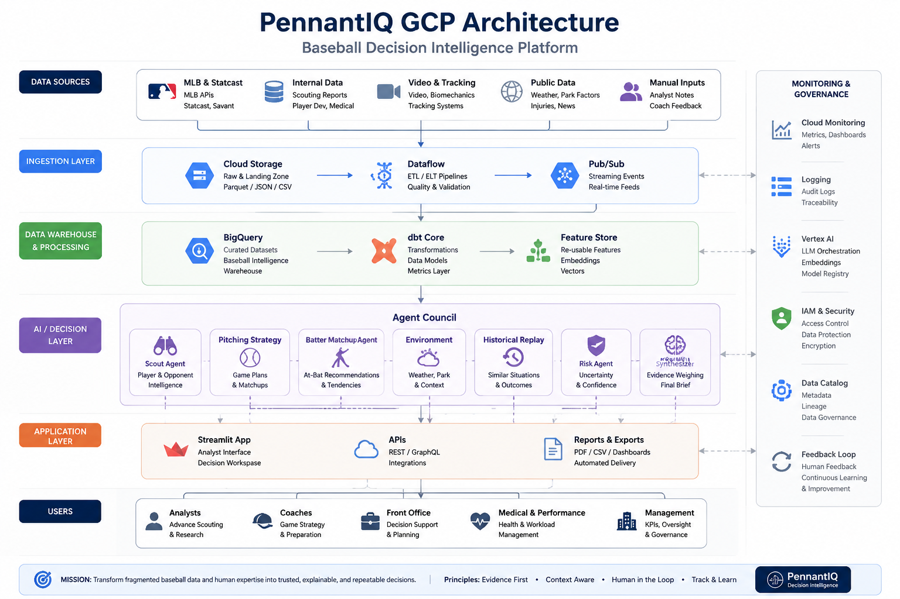
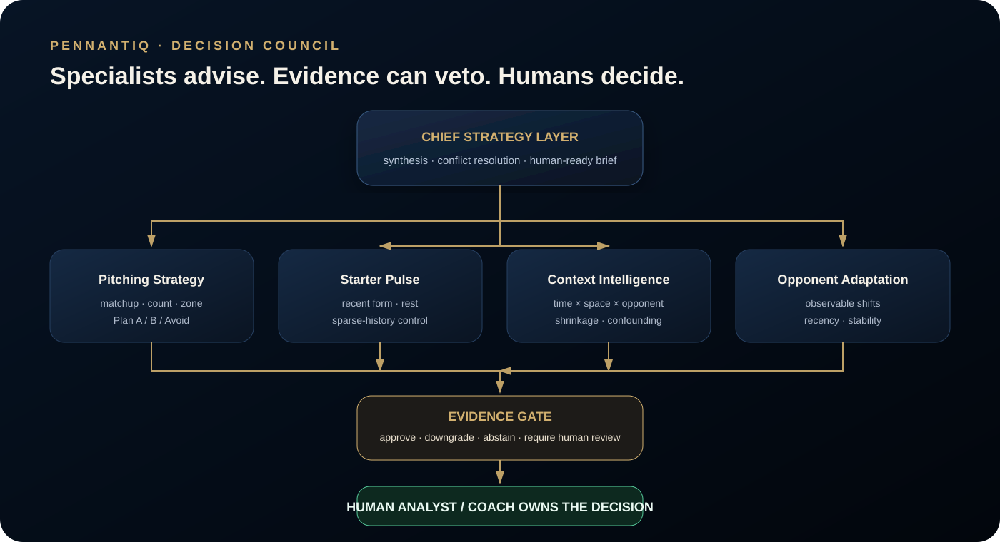

<div align="center">


# PennantIQ
## Baseball Decision Intelligence Platform

### **Championships are won in moments. Dynasties are built in systems.**

*Prepare before the game. Commit the decision. Replay the outcome. Preserve the lesson.*

[Quick start](#quick-start) · [Real data](#real-data-without-breaking-reproducibility) · [Architecture](#gcp-production-target) · [Evaluation](#evaluation) · [Roadmap](docs/ROADMAP.md)

[](https://github.com/cssaritama/pennantiq-baseball-decision-intelligence/actions/workflows/ci.yml)
[](https://github.com/cssaritama/pennantiq-baseball-decision-intelligence/actions/workflows/live-llm-evaluation.yml)

</div>



> **Independent research prototype.** PennantIQ is not affiliated with, endorsed by or sponsored by Major League Baseball or any MLB club. It does not guarantee wins, titles, medical outcomes or causal effects.

---

## Problem statement

Professional baseball organizations have access to unprecedented amounts of data: pitch tracking, scouting reports, video, biomechanics, historical performance and contextual analysis. The challenge is no longer data availability. The challenge is transforming these complex and diverse signals into aligned, explainable and repeatable decisions under competitive pressure.

Today, critical evidence often lives across separate tools, workflows and human expertise: pitch-level events, scouting methodology, opponent tendencies, contextual splits and organizational knowledge. Before a game or series, analysts and baseball operations teams must synthesize this fragmented evidence quickly while avoiding small-sample traps, future-data leakage and unsupported certainty. After the game, the original reasoning behind a decision is often difficult to reconstruct, limiting organizational learning and continuous improvement.

PennantIQ addresses this decision-intelligence challenge by creating an evidence-gated system that connects data, analysis, human judgment and organizational memory.

The first PennantIQ user is an **Advance Scouting Analyst or Baseball Strategy Analyst** preparing pitcher–batter and starter decisions. The initial questions are deliberately concrete:

- How is this starter arriving relative to recent appearances?
- What evidence supports each strategic option, and what scenarios present higher uncertainty or risk?
- Does the answer change by handedness, venue, rest, count or other context?
- Is the available evidence strong enough to support a decision, or should uncertainty be explicitly communicated?
- What did we know before the game, what did we choose, and what should we learn afterward?

A generic chatbot is not enough because it can produce fluent answers without statistical provenance, context and decision traceability. A pure dashboard is not enough because it describes data without preserving the reasoning behind a decision. PennantIQ therefore treats the problem as an **evidence-gated decision-learning loop**.

### Success criteria for the public prototype

The prototype succeeds when it can: (1) ingest reproducible baseball data and methodology, (2) retrieve the right evidence, (3) use a real LLM to explain and synthesize without replacing deterministic calculations, (4) abstain when support is weak, (5) expose provenance and confidence, (6) record user feedback, and (7) replay historical decisions using only information that existed at the time. It does **not** claim that a recommendation guarantees a win or that a historical alternative would have caused a different result.

## Solution

PennantIQ combines two complementary data paths:

1. **Structured decision data** — pitch/event data is analyzed by deterministic Python tools for matchup, starter, context and Shadow Mode calculations.
2. **Unstructured baseball knowledge** — project methodology and operating policies are indexed in a knowledge base and retrieved with evaluated keyword/vector methods.

The LLM sits above those tools as an explanation and orchestration layer. The Decision Council receives the evidence package, challenges weak conclusions through an Evidence Gate, and produces a human-readable brief. Monitoring captures feedback, latency, evidence strength and abstention behavior. The resulting decision can later be compared with the observed outcome and stored as organizational memory.

## The product

PennantIQ is an evidence-first **Baseball Decision Intelligence Platform** for professional baseball organizations. It combines governed data products, deterministic baseball analytics, specialized decision agents and organizational memory. The public prototype is team-agnostic; New York is the flagship public proving ground and repeat champions are external benchmarks—not assumed customers or proprietary templates.

It is not a scoreboard, fantasy game or generic baseball chatbot. Its core purpose is decision support:

1. unify structured baseball data and methodology;
2. describe how a pitcher or hitter is arriving;
3. compare matchup and contextual signals;
4. abstain when evidence is insufficient;
5. record what the organization chose and why;
6. replay the decision after the game without future-data leakage;
7. turn the result into searchable organizational memory.

The public release focuses on pitcher–batter and starter preparation because that is a measurable, event-rich entry point. The platform roadmap extends to bullpen, lineup, offense, defense, baserunning, player development, roster and governance modules.

## Positioning

PennantIQ is not built *for one team*. It is built for any professional baseball organization, with configurable organization context and strict data boundaries.

- **PennantIQ Open** — public, reproducible research and portfolio surface.
- **PennantIQ Team** — private team intelligence, proprietary data and models.
- **PennantIQ Lab** — Shadow Mode, benchmarks, evaluation and research.
- **PennantIQ Integrity** — future AI governance and competitive-integrity layer for leagues.

**New York showcase:** Yankees = championship-edge optimization; Mets = turnaround intelligence.

**Dynasty benchmark:** the 2024–2025 Dodgers are used only as a public example of repeat championship performance. PennantIQ does not claim access to or knowledge of their proprietary methods.

## Why this matters

Baseball organizations already have large volumes of tracking and event data. The harder problem is preserving a transparent chain from **signal → interpretation → choice → outcome → lesson**.

PennantIQ is designed around five differentiators:

- **Starter Pulse:** recent-appearance and pitch-shape signals with explicit limitations;
- **Time × Space Context Engine:** day, home/away, handedness, venue, rest, game time, weather and order-cycle splits with shrinkage and sample warnings;
- **Opponent Adaptation Signals:** observable changes across time windows rather than claims about player intent;
- **Shadow Mode:** chronological historical replay using only information available before the evaluation date;
- **Decision Ritual:** a human decision journal that records intention, evidence, confidence, outcome and lesson.

The LLM explains and orchestrates. Deterministic tools perform the statistics.



---

## Implemented in v0.1.0

### Product workspaces

| Workspace | Purpose |
|---|---|
| Command Center | Data freshness, included real New York results and source portfolio |
| Starter Pulse | Last appearances, velocity, whiff, hard-contact and evidence signals |
| Matchup Lab | Plan A, Plan B, Avoid, adaptation signals and abstention |
| Decision Council | Four specialist evidence agents plus Chief Strategy synthesis |
| Context Matrix | Time, location, handedness, rest, opponent and venue splits |
| Shadow Mode | Leakage-safe historical recommendation replay |
| Ask PennantIQ | RAG/agent decision brief with evidence package |
| Decision Ritual | Decision memory and learning-loop discipline |
| Trust & Monitoring | Provenance, assumptions, feedback, latency and abstention |
| GCP Platform | Production architecture and deployment blueprint |

### Engineering and Zoomcamp scope

- automated ingestion with `dlt`;
- deterministic pitch analytics;
- keyword, TF-IDF vector, hybrid and reranked retrieval;
- query rewriting;
- optional OpenAI and Gemini providers;
- organization profiles for a generic club, Yankees showcase, Mets turnaround case and Dodgers dynasty benchmark;
- auditable Decision Council workflow designed to migrate to Vertex AI ADK;
- Streamlit interface;
- user feedback and SQLite monitoring;
- decision-memory SQLite store;
- retrieval and answer evaluation scripts;
- chronological Shadow Mode;
- Docker and Docker Compose;
- CI, tests and repository audit;
- optional Statcast, Retrosheet and GCP adapters;
- 20 automated tests in the packaged release.

---

## Brand thesis

> **For baseball organizations building like dynasties.**

> **Data tells you what happened. PennantIQ helps your organization decide what comes next.**

> **We do not predict destiny. We build the system that earns better decisions.**

The emotional mission may be ambitious—help build the decision infrastructure capable of bringing October glory to a city—but product claims remain measurable: preparation speed, evidence quality, decision traceability, abstention discipline and learning-loop completion.

See [Brand Narrative](docs/BRAND_NARRATIVE.md), [Multi-Agent Architecture](docs/MULTI_AGENT_ARCHITECTURE.md) and [Day in the Life](docs/DAY_IN_THE_LIFE.md).

## Quick start

### Option A — Docker

```bash
git clone https://github.com/cssaritama/pennantiq-baseball-decision-intelligence.git
cd pennantiq-baseball-decision-intelligence
docker compose up --build
```

Open `http://localhost:8501`.

### Option B — Local Python

Python 3.12 is recommended.

```bash
python -m venv .venv
source .venv/bin/activate          # Windows: .venv\Scripts\activate
python -m pip install --upgrade pip
pip install -r requirements-dev.txt
make verify
streamlit run app.py
```

The default mode requires no API key and no internet connection.

### Real LLM providers

The application supports Gemini, OpenAI and GitHub Models. The certificate repository also includes a GitHub Actions workflow that can run the live LLM comparison with the repository's automatic `GITHUB_TOKEN` and the `models: read` permission—no external API key is required for that CI evaluation.

For local Gemini/OpenAI usage:

```bash
pip install -r requirements-llm.txt
cp .env.example .env
```

Set either:

```bash
LLM_PROVIDER=openai
OPENAI_API_KEY=...
```

or:

```bash
LLM_PROVIDER=gemini
GEMINI_API_KEY=...
```

For GitHub Models outside Actions, provide a token with model access:

```bash
LLM_PROVIDER=github
GITHUB_MODELS_TOKEN=...
GITHUB_MODELS_MODEL=openai/gpt-4o
```

The deterministic mode remains the source of truth for calculations.

---

## Real data without breaking reproducibility

PennantIQ uses a four-mode data strategy.

### 1. Bundled synthetic pitch fixture

`data/sample/demo_pitches.csv`

- 18,000 deterministic fictional pitch events;
- includes context fields for UI, testing and backtesting;
- always available;
- never presented as MLB evidence.

### 2. Bundled frozen real snapshot

`data/frozen_real/new_york_results_2026.csv`

- final Yankees and Mets game results from July 1–21, 2026;
- included for a factual Command Center demonstration;
- game-level only;
- not used as pitch-level evidence.

### 3. User-downloaded Statcast pitch data

Install the optional connector:

```bash
pip install -r requirements-real.txt
python scripts/download_statcast_pybaseball.py \
  --start 2026-07-01 \
  --end 2026-07-21 \
  --team NYY \
  --output data/real/nyy_statcast.csv
```

Then either upload the CSV in the interface or run:

```bash
PENNANTIQ_DATA_PATH=data/real/nyy_statcast.csv streamlit run app.py
```

`pybaseball.statcast` retrieves one row per pitch and supports a team filter. Baseball Savant documents fields such as pitch type, velocity, location, handedness, scores, order cycle and days since the previous game. Source terms must be reviewed before use or redistribution.

- pybaseball: https://pypi.org/project/pybaseball/
- Statcast CSV fields: https://baseballsavant.mlb.com/csv-docs
- MLB Terms of Use: https://www.mlb.com/official-information/terms-of-use

### 4. Retrosheet historical data

Retrosheet publishes game and play data through 2025 and permits commercial use with a mandatory attribution statement.

```bash
python scripts/download_retrosheet.py --year 2025
```

- downloads selected game, team and pitching CSVs;
- writes the required attribution beside the files;
- supports game-state, bullpen, lineup and historical validation modules.

Source and current notice: https://www.retrosheet.org/downloads/csvdownloads.html

### Important data rule

**More data is not automatically better.** PennantIQ separates eras, preserves timestamps, applies recency weighting, identifies context gaps and avoids mixing incompatible tracking definitions without documentation. Baseball Savant notes that plate-location and strike-zone definitions changed in 2026 to align with ABS; cross-era analysis must account for that change.

See [Real Data Guide](docs/REAL_DATA_GUIDE.md) and [Data Card](docs/DATA_CARD.md).

---

## What context is considered?

The public Context Engine can evaluate:

### Time

- recency and rolling windows;
- day of week;
- local game-time bucket and day/night;
- season phase;
- days of rest;
- appearance number;
- inning and times through the order when available.

### Space and environment

- home versus away;
- venue and opponent;
- handedness matchup;
- pitch location;
- temperature, wind, roof and elevation when available.

### Competitive context

- count;
- pitch family and zone;
- recent pitch mix;
- whiff and hard-contact signals;
- sample size and evidence stability.

A result such as “better on Wednesdays” is never treated as causal. It remains exploratory until it survives minimum samples, shrinkage, out-of-sample validation and controls for rest, rival, venue and role.

---

## What happens with a debuting pitcher?

PennantIQ activates a **Debutant / Sparse-History Protocol**:

1. marks player-specific evidence as insufficient;
2. refuses fake precision;
3. uses verified role and handedness;
4. requests licensed minor-league tracking or scouting evidence;
5. constructs peer priors from comparable arsenal/release traits;
6. requires human approval;
7. updates the player model as real observations arrive.

The public prototype demonstrates the policy. A commercial team edition would connect to team-owned minor-league, biomechanics, video and scouting data.

See [Debutant Protocol](docs/DEBUTANT_PROTOCOL.md).

---

## Shadow Mode: test the past without cheating

For each evaluation day:

1. cut the dataset at the prior day;
2. build recommendation tables only from historical information;
3. generate a plan and evidence label;
4. reveal the observed pitch and outcome;
5. compare the recommendation with the historical action;
6. preserve the result and warning.

Shadow Mode proves that PennantIQ can generate a time-valid recommendation. It does **not** prove that a different pitch would certainly have caused a better outcome, because historical decisions were not randomized and private context may be missing.

```bash
make shadow
```

---

## Evaluation

```bash
make evaluate
make shadow
pytest -q
```

Retrieval approaches:

- keyword;
- TF-IDF vector;
- hybrid;
- hybrid + overlap reranking.

Retrieval benchmark: **24 questions** across four methods. The current evaluated winner is **TF-IDF vector retrieval (MRR@5 0.951)** and `Retriever.best()` uses the generated winner by default. Hybrid search and reranking remain implemented and evaluated.

Answer evaluation has two layers:

- offline policy comparison: direct vs retrieval-grounded vs evidence-aware deterministic behavior;
- live provider comparison: Direct LLM vs RAG LLM vs Agent + Evidence using Gemini/OpenAI credentials.

The live LLM comparison must be executed before the final certificate commit if claiming the LLM-evaluation criterion. Generated outputs are written to `evaluation/results/`; metrics are never hand-written as achievements.

See [Evaluation](docs/EVALUATION.md) and [Rubric Traceability](docs/RUBRIC_TRACEABILITY.md).

---

## GCP production target

The local application is deliberately easy to clone. The private enterprise architecture is designed for Google Cloud:

| Layer | GCP target |
|---|---|
| Raw and licensed data | Cloud Storage |
| Ingestion | Cloud Run Jobs or Dataflow |
| Governed analytics | BigQuery + Dataform |
| Semantic retrieval | BigQuery Vector Search / Vertex AI Search |
| Models and agents | Vertex AI |
| Application | Cloud Run |
| Decision memory | BigQuery and/or Cloud SQL |
| Secrets and access | Secret Manager + IAM + VPC Service Controls |
| Observability | Cloud Logging + Cloud Monitoring |
| Executive analytics | Looker |

Google Cloud describes Statcast as a Google Cloud-based platform and has documented BigQuery/Vertex AI use in MLB data products. That makes GCP strategically aligned, not automatically superior for every workload.

- MLB customer story: https://cloud.google.com/customers/major-league-baseball
- MLB/BigQuery team analytics: https://cloud.google.com/transform/mlb-statcast-ai-fan-experience-team-analytics

Optional adapters and a conservative Terraform foundation are under `src/pennantiq/gcp.py` and `infra/gcp/`.

```bash
pip install -r requirements-gcp.txt
gcloud auth application-default login
terraform -chdir=infra/gcp init
terraform -chdir=infra/gcp plan -var="project_id=YOUR_PROJECT"
```

No infrastructure is claimed as deployed until it has actually been provisioned and tested.

See [GCP Architecture](docs/GCP_ARCHITECTURE.md).

---

## Public and private boundary

### PennantIQ Open — this repository

- reproducible application;
- public methods and benchmarks;
- deterministic demo data;
- limited frozen real result snapshot;
- optional user-initiated public-data connectors;
- baseline context, matchup and Shadow Mode engines;
- evaluation, monitoring and documentation.

### PennantIQ Team — future private repository

Create it only when there is genuine private value:

- licensed or team-owned pitch, video and biomechanics data;
- proprietary feature engineering;
- organization-specific models;
- validated Adaptation Fingerprints;
- causal/off-policy scenario engine;
- confidential scouting knowledge;
- access controls, tenancy and private deployment;
- team decision memory and pilot results.

Do not create empty private folders to imply nonexistent capabilities. Public contracts for future modules are documented under `modules/`; private implementation begins after data rights and validation exist.

---

## Is this a game idea?

PennantIQ can support an educational or fan-facing simulation later, but the core product is a professional decision platform. A gamified public module could let users construct a series plan and compare it with Shadow Mode outcomes, without exposing private team logic. It should be treated as an acquisition and education surface—not as the main commercial moat.

---

## Championship thesis

The mission may be emotionally ambitious:

> **Build the decision infrastructure capable of helping return a championship to New York.**

The commercial promise must remain defensible:

> **PennantIQ helps organizations prepare faster, expose uncertainty, preserve accountability and learn systematically from every series.**

No responsible data platform can guarantee a championship. Baseball outcomes depend on player execution, health, opponent adaptation, randomness, roster quality and many private factors. The product earns trust by increasing decision quality and learning speed—not by selling certainty.

---

## Repository quality gates

```bash
make verify
```

The verification workflow performs:

- Python compilation;
- repository audit;
- tests;
- retrieval evaluation;
- answer evaluation;
- Shadow Mode.

Before a public release also verify:

- Docker build on a clean machine;
- Streamlit visual review;
- optional real-data connector with a small bounded query;
- no secrets or downloaded restricted data in Git;
- screenshots and demo video match the actual release;
- all badges and URLs point to the real repository.

---

## Zoomcamp evaluation map

The official course rubric is mapped directly to files and commands so reviewers do not need to infer where evidence lives.

| Official criterion | PennantIQ evidence | Verification |
|---|---|---|
| Problem description | `README.md` → Problem statement / Solution | Manual review |
| Retrieval flow | `knowledge_base/`, `src/pennantiq/retrieval.py`, real LLM providers | Ask PennantIQ / `src/pennantiq/agent.py` |
| Retrieval evaluation | 24-case benchmark, four methods, winner used by default | `python evaluation/run_retrieval_evaluation.py` |
| LLM evaluation | Direct LLM vs RAG LLM vs Agent + Evidence | `python evaluation/run_live_llm_evaluation.py` or Live LLM Evaluation Action |
| Interface | Streamlit multi-workspace UI | `streamlit run app.py` |
| Ingestion pipeline | automated `dlt` → DuckDB pipeline | `python -m src.pennantiq.ingestion` |
| Monitoring | user feedback + >=5 dashboard views | Trust & Monitoring workspace |
| Containerization | complete app in Docker Compose | `docker compose up --build` |
| Reproducibility | pinned versions, bundled deterministic data, scripts and docs | `make verify` |
| Hybrid search | keyword + vector fusion | retrieval evaluation |
| Document re-ranking | explicit reranking method | retrieval evaluation |
| User query rewriting | deterministic query rewrite policy | retrieval tests / code |
| Cloud bonus | GCP architecture only until a real deployment is verified | no deployment bonus claimed yet |

The course also requires a public repository and commit hash for peer review, and students must review three peer projects. See [`docs/RUBRIC_TRACEABILITY.md`](docs/RUBRIC_TRACEABILITY.md) and the official project instructions linked there.

---

## Key documents

- [Multi-Agent Architecture](docs/MULTI_AGENT_ARCHITECTURE.md)
- [Brand Narrative](docs/BRAND_NARRATIVE.md)
- [Dynasty Benchmark](docs/DYNASTY_BENCHMARK.md)
- [MLB AI Boundary](docs/MLB_AI_BOUNDARY.md)
- [Day in the Life](docs/DAY_IN_THE_LIFE.md)
- [Open-Core Plugin Boundary](docs/OPEN_CORE_PLUGIN_BOUNDARY.md)
- [Competitive Landscape](docs/COMPETITIVE_LANDSCAPE.md)
- [Platform Blueprint](docs/PLATFORM_BLUEPRINT.md)
- [Product Requirements](docs/PRODUCT_REQUIREMENTS.md)
- [Real Data Guide](docs/REAL_DATA_GUIDE.md)
- [Context Engine](docs/CONTEXT_ENGINE.md)
- [Debutant Protocol](docs/DEBUTANT_PROTOCOL.md)
- [Decision Consciousness](docs/DECISION_CONSCIOUSNESS.md)
- [Dashboard Specification](docs/DASHBOARD_SPEC.md)
- [GCP Architecture](docs/GCP_ARCHITECTURE.md)
- [Championship Thesis](docs/CHAMPIONSHIP_THESIS.md)
- [Open-Core Plugin Boundary](docs/OPEN_CORE_PLUGIN_BOUNDARY.md)
- [Roadmap](docs/ROADMAP.md)

---

## Founder-built prototype

PennantIQ v0.1.0 is a founder-built open-core research prototype designed as the first layer of a future enterprise delivery team. No employees, clients, investors, pilots or club affiliations are implied unless independently verified.

## License

Code is released under the Apache License 2.0. Data sources retain their own rights and notices. Review `NOTICE.md`, `docs/LEGAL_AND_DATA_BOUNDARIES.md` and source-specific terms before use.


## Competitive reality

PennantIQ does not claim that AI, multi-agent scouting or baseball analytics are unique. Its differentiation hypothesis is the evidence-gated decision-learning loop. See [Competitive Landscape](docs/COMPETITIVE_LANDSCAPE.md).
