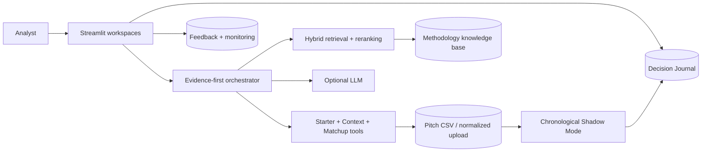

# Architecture

## Reproducible public runtime

The LLM explains. Deterministic tools calculate. The application runs without a provider key.

## GCP team target

See [GCP Architecture](GCP_ARCHITECTURE.md) for layers, datasets, controls and Terraform boundaries.
